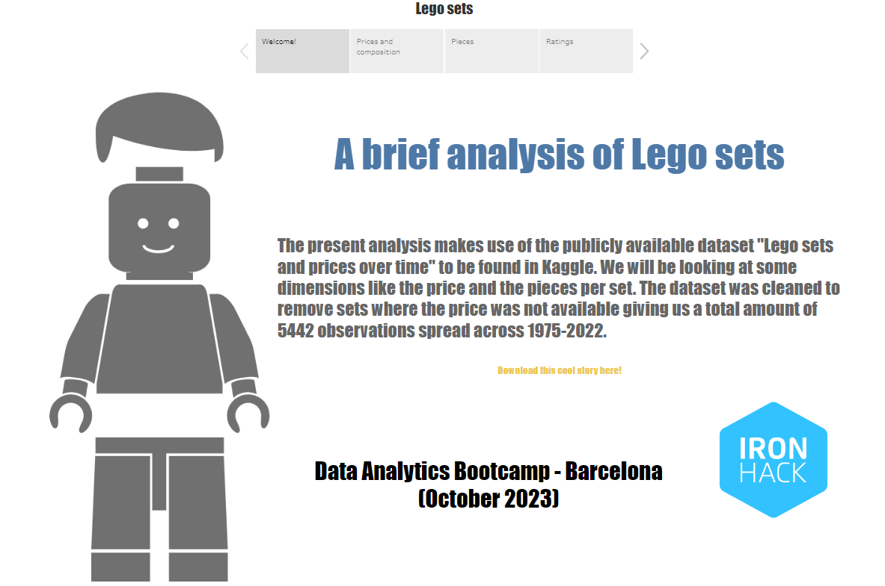

# Welcome to the Lego dataset project!

This project, the 4th in our bootamp marks the usages of Tableau as a visualization tool. We were given the possibility to choose / build a dataset from the several tools we have at our disposal (existing databases, web scrapping, APIs). I will be working with a dataset from Kaggle.

## 1 The process and the resources
#### For this project I made use of the several softwares we've been working with:
- Python: to explore data and clean the dataset
- MySQL: to explore relationships within the cleaned data
- Tableau: as a visualisation tool

#### Notes on the dataset:
I am using the dataset [LEGO Sets and Prices Over Time](https://www.kaggle.com/datasets/alexracape/lego-sets-and-prices-over-time) to be found in Kaggle. I must praise that the dataset was pretty much clean taking me only some removal of unuseful columns and cleaning of NaN. The following libraries were used:

- pandas - to represent in tabular for in Python my dataset
- pymysql - to query the database in MySQL via Python (this was also performed apart in MySQL itself, the corresponding file can be found in the folder src of this project with the name **Lego**)
- sqlalchemy - to generate an engine so I could perform the queries
- getpass - to access the correct MySQL environment while keeping my credentials confidential

This was my workflow:

## 2 The dataset and the visualizations

The chosen dataset provides us with information on several dimensions of the Legos datasets across the timeframe 1975-2022:

- Name of the dataset
- Theme (and theme-group)
- Category (Collection, Gear, Extended...)
- Availability
- Number of instructions
- Rating
- Current Price

**Tableau** allows for an easy an intuitive way to represent the data. My final visualization can be found published [->here<-](https://public.tableau.com/app/profile/ricardo.beato/viz/Legosets_17003396565510/LegoStory?publish=yes)

## 3 The conclusions

- To some extent, older lego sets tend to be more expensive reflecting the accrual of some collectable value
- Arts and crafts, model making and technical are the theme-groups where the average number of pieces is the highest reflecting the technicality and complexity of these sets. On the opposite end we have pre-school, girls and construction as the "simplest" lego sets aimed mostly at children
- More pieces equate in a general way to a higher price for the set. Here we have to take into account that for some sets, the number of pieces come as an accessory argument as the intrinsic value of the set itself defines the price (collectables, vintage, etc.)
- The rating of the set also plays a key role. Sets rated 4+ show a significant premium over the rest, whereas this average price increase is not as relevant when analysing 3+ against 2+ ratings for example

## That's all folks!
